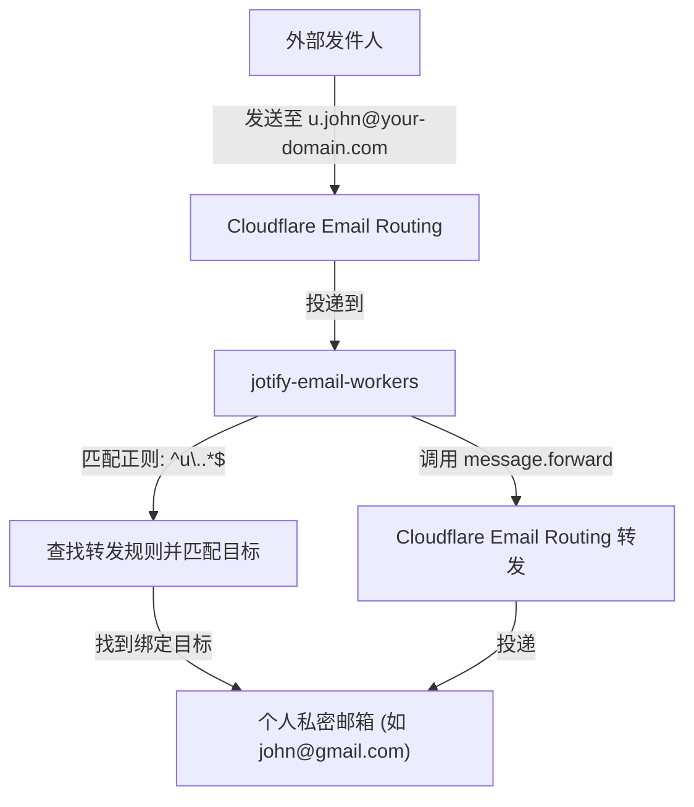
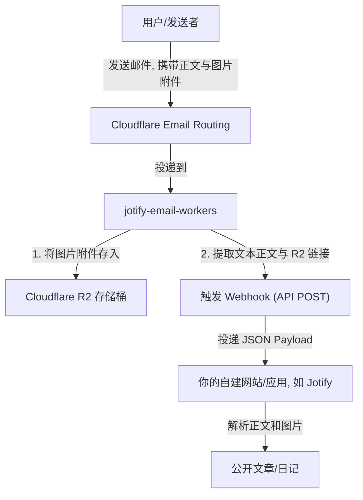

# Jotify Email Workers

一个基于 **Cloudflare Workers** + **CloudFlare Email Routing** 部署的邮件托管、转发与 API Webhook 服务。

---

## 💡 主要功能

### 1. 邮件托管和转发

* **多用户机制**：用户可自主登录系统，并管理属于自己的域名与收信规则。
* **特定邮件分流（正则匹配）**：支持使用**正则表达式**匹配收件用户名（`@` 前面的部分），根据规则将特定邮件分流转发至不同的目标邮箱，或触发不同的 API Webhook。
* **支持全收（Catch-all）**：延续 Cloudflare Email Routing 的全收服务，支持通配域名下所有未定义的前缀。

### 2. API 集成与 Webhook 投递

* **Cloudflare Email Routing**：
  * **原理**：`jotify-email-workers` 基于 Cloudflare Email Routing 进行邮件收取。当有新邮件投递到绑定的域名时，Email Routing 会触发 Worker 的 `email` 处理器进行解析和规则分配。
* **结构化投递**：解析邮件主题（支持 `[public]/[private]` 标签）与纯文本主体。
* **附件 R2 转存**：如果配置了 Cloudflare R2 存储桶，邮件附件（如图片、音频等）会自动转存至 R2，并在 Webhook API 的 payload 中带上公网可访问 the URL 链接。

---

## ⚙️ 环境变量配置 (`vars`)

在本地开发部署（`.dev.vars`）或生产部署（Wrangler / Cloudflare Dashboard 环境变量）时，需要配置以下字段：

| 变量名 | 必填 | 默认值 / 示例 | 作用与说明 |
| :--- | :--- | :--- | :--- |
| `BETTER_AUTH_SECRET` | 是 | *(随机32位字符串)* | 用于 Better Auth 身份验证会话加密的密钥。可使用 `openssl rand -hex 32` 生成。 |
| `BETTER_AUTH_URL` | 是 | `http://localhost:8787` | 本 Email Worker 管理后台部署后的访问根路径（含 HTTP 协议）。 |
| `RESEND_API_KEY` | 是 | `re_123456789...` | [Resend](https://resend.com) 邮件服务 API Key，用于发送账号注册验证码及找回密码邮件。 |
| `RESEND_FROM_NAME` | 否 | `Jotify` | 发送验证码邮件时的发件人友好名称。 |
| `RESEND_FROM_EMAIL` | 否 | `onboarding@resend.dev` | 发送验证码邮件时的已验证发件人电子邮箱。 |
| `ALLOW_REGISTER` | 否 | `true` | 是否允许新用户自主注册账号。设为 `false` 则关闭注册。 |
| `REQUIRE_APPROVAL` | 否 | `true` | 新注册用户是否需要管理员审核。设为 `false` 则注册后自动激活。 |
| `MAX_DOMAINS_PER_USER` | 否 | `1` | 每个普通用户允许添加和绑定的收信域名上限。 |
| `SUPERADMIN_EMAIL` | 是 | `jotify@your-domain.com` | 默认初始超级管理员的登录邮箱（数据库为空时会自动初始化）。 |
| `SUPERADMIN_PASSWORD` | 是 | `admin123456` | 默认初始超级管理员的登录密码。 |
| `R2_PUBLIC_URL` | 否 | `https://cdn.domain.com` | R2 存储桶绑定的公网访问域名（若需要启用 Webhook 附件转发，则必须配置）。 |
| `TURNSTILE_SITE_KEY` | 否 | `3x0000...` | Cloudflare Turnstile 人机验证 Site Key，留空则不启用登录/注册验证码。 |
| `TURNSTILE_SECRET_KEY` | 否 | `1x0000...` | Cloudflare Turnstile 人机验证 Secret Key，留空则不启用。 |

---

## 🎨 典型集成场景

### 场景 1：邮件隐藏与中转转发（匿名邮箱转发）

当你在外部网站注册账户时，不想暴露真实的个人邮箱，可以使用本服务生成临时的或正则匹配的别名邮箱，并将邮件转发回真实邮箱。

* *例如*：收信域名为 `your-domain.com`，匹配规则为 `^u\..*$`，转发至真实邮箱 `john@gmail.com`。发往 `u.test@your-domain.com` 或 `u.bank@your-domain.com` 的邮件都会自动且无损地中转转发至你的 Gmail。



### 场景 2：写邮件自动发表文章（邮件发布/随机邮箱发布）

你的应用（如博客、笔记等）需要支持“通过发送邮件直接写日记/发布文章”的功能。

* *例如*：匹配规则为 `^jot_.*$`（如 `jot_cUpeNw56p66X@your-domain.com`），绑定 Webhook 到自建的日记平台。用户只要向该地址发送带有文字和照片的邮件，Worker 就会把附件转存 R2，并把文本和图片 URL 投递给日记平台，自动发布出一篇日记。



---

## 🛠️ 开发与部署

### 1. 本地开发准备

1. 将 `.dev.vars.example` 复制为 `.dev.vars`，并修改里面的变量。
2. 初始化本地 D1 数据库：

   ```bash
   npx wrangler d1 migrations apply DB --local
   ```

3. 运行本地开发服务器（同时运行前端 Dashboard 与后端 Hono API）：

   ```bash
   npm run dev
   ```

### 2. 线上部署上线

1. 运行数据库迁移应用到线上 D1 数据库：

   ```bash
   npx wrangler d1 migrations apply DB --remote
   ```

2. 编译并部署 Worker：

   ```bash
   npm run build
   npm run deploy
   ```

3. **域名绑定与邮件路由**：
   在 Cloudflare 控制台中将目标域名的 **Email Routing** 开启 **Catch-all** 规则，并将其直接路由到你部署的 `jotify-email-workers`。
